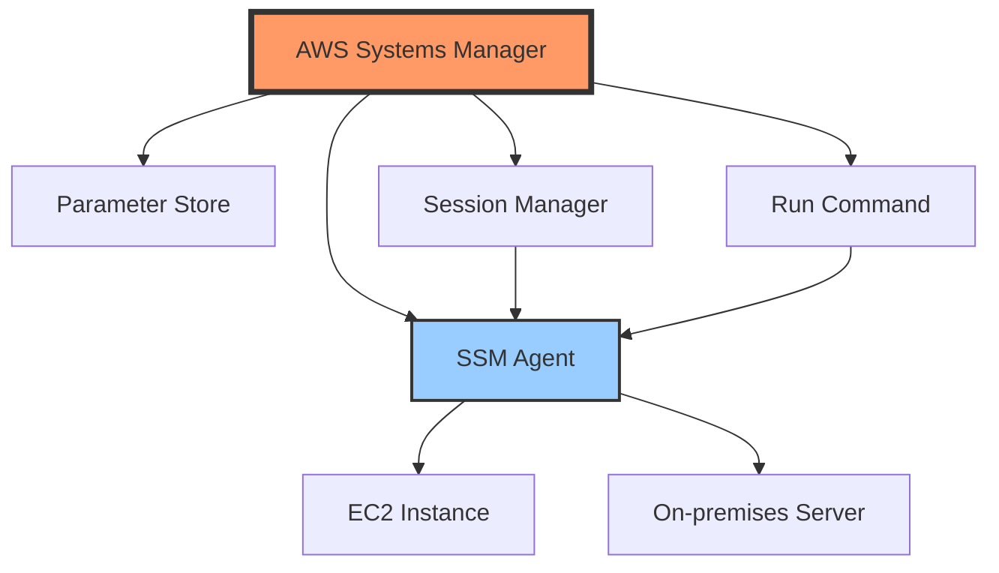
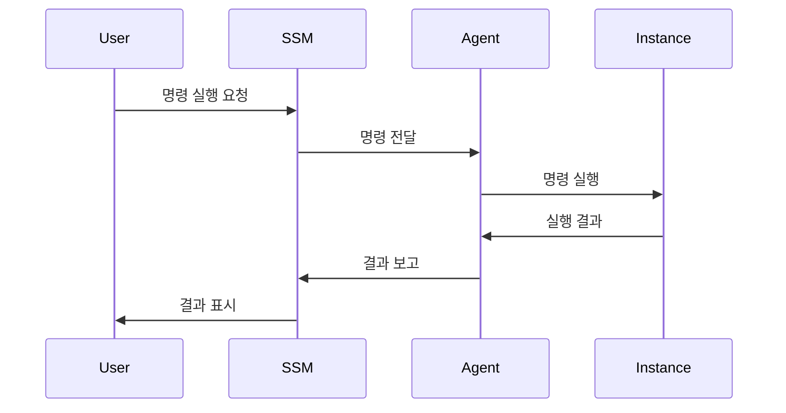

# 개념 설명
AWS Systems Manager(SSM)는 AWS 인프라를 관리하기 위한 통합 관리 서비스이다. 이는 마치 대규모 건물의 통합 관리 시스템과 같다:
- 건물의 모든 상태 모니터링 (인스턴스 상태 관리)
- 정기적인 유지 보수 일정 관리 (자동화)
- 긴급 상황 대응 (Run Command)
- 출입 통제 및 보안 관리 (세션 관리)

## 주요 구성 요소
1. Fleet Manager
   - 하이브리드 환경의 노드 관리
   - 운영 체제 관리
   - 성능 모니터링

2. Parameter Store
   - 구성 데이터 관리
   - 암호 및 인증 정보 저장
   - 애플리케이션 설정 관리

3. Run Command
   - 원격 명령 실행
   - 대규모 인스턴스 관리
   - 자동화된 작업 수행

# 기본 동작 방식

## 아키텍처 구성


## 통신 흐름


# 실제 사용 예시

## Parameter Store 활용
```python
# 잘못된 예시 - 하드코딩된 설정값
def get_database_config_bad():
    """
    데이터베이스 설정을 하드코딩하는 잘못된 방식
    """
    return {
        'host': 'production-db.example.com',
        'password': 'secretpassword123'  # 보안 위험
    }

# 올바른 예시 - Parameter Store 사용
import boto3

def get_database_config_good():
    """
    SSM Parameter Store를 활용한 안전한 설정 관리
    """
    ssm = boto3.client('ssm')
    
    response = ssm.get_parameters(
        Names=[
            '/app/database/host',
            '/app/database/password'
        ],
        WithDecryption=True
    )
    
    config = {}
    for param in response['Parameters']:
        name = param['Name'].split('/')[-1]
        config[name] = param['Value']
    
    return config
```

## Run Command 실행
```python
def execute_command_on_instances(instance_ids, command):
    """
    여러 인스턴스에 명령을 실행하는 함수
    
    Args:
        instance_ids: 대상 인스턴스 ID 리스트
        command: 실행할 Shell 명령어
    """
    ssm = boto3.client('ssm')
    
    response = ssm.send_command(
        InstanceIds=instance_ids,
        DocumentName='AWS-RunShellScript',
        Parameters={'commands': [command]}
    )
    
    command_id = response['Command']['CommandId']
    return command_id

def check_command_status(command_id):
    """
    실행된 명령의 상태를 확인하는 함수
    """
    ssm = boto3.client('ssm')
    
    response = ssm.list_command_invocations(
        CommandId=command_id,
        Details=True
    )
    
    return response['CommandInvocations']
```

# 고급 활용법

## 자동화 워크플로우
```python
class SSMAutomation:
    """SSM 자동화 워크플로우 관리 클래스"""
    
    def __init__(self):
        self.ssm = boto3.client('ssm')
    
    def start_automation(self, document_name, parameters):
        """
        자동화 워크플로우를 시작한다
        """
        response = self.ssm.start_automation_execution(
            DocumentName=document_name,
            Parameters=parameters
        )
        
        return response['AutomationExecutionId']
    
    def get_automation_status(self, execution_id):
        """
        자동화 실행 상태를 확인한다
        """
        response = self.ssm.get_automation_execution(
            AutomationExecutionId=execution_id
        )
        
        return response['AutomationExecution']['Status']
```

# 주의사항

## 보안 고려사항
1. IAM 권한 관리
   - 최소 권한 원칙 적용
   - 역할 기반 접근 제어 구현
   - 정기적인 권한 검토

2. 암호화
   - 중요 파라미터는 항상 암호화
   - KMS 키 관리 철저
   - 암호화 키 교체 정책 수립

## 운영 고려사항
1. 에이전트 관리
   - SSM Agent 버전 관리
   - 자동 업데이트 설정
   - 건강 상태 모니터링

2. 성능 관리
   - 동시 실행 제한 설정
   - 타임아웃 값 조정
   - 리소스 사용량 모니터링

# 결론
AWS Systems Manager는 AWS 인프라 관리를 위한 필수적인 도구이다. Parameter Store를 통한 구성 관리, Run Command를 통한 원격 명령 실행, Session Manager를 통한 안전한 접속 관리 등 다양한 기능을 제공한다. 보안과 운영 효율성을 모두 고려한 적절한 설계와 구현이 중요하며, 지속적인 모니터링과 관리가 필요하다.