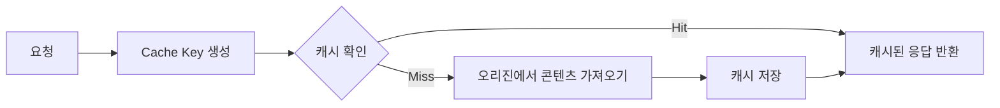
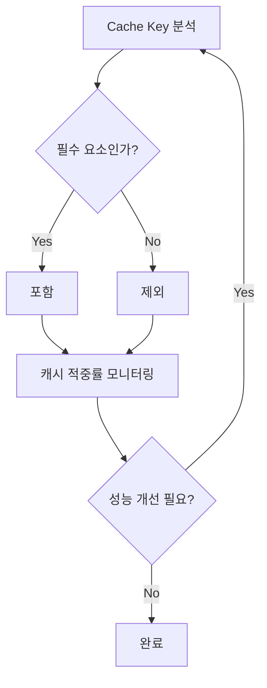

AWS CloudFront Cache Key 완벽 가이드

# Cache Key 개념 이해하기

## 기본 개념
Cache Key는 마치 도서관의 책 분류 번호와 같다. 도서관에서 책을 찾을 때 분류 번호를 사용하듯이, CloudFront는 Cache Key를 사용하여 캐시된 콘텐츠를 식별하고 검색한다.

## 기본 구조


# Cache Key 구성 요소

## 1. 기본 구성 요소
- URL 경로
- 호스트 이름
- 프로토콜(HTTP/HTTPS)

## 2. 선택적 구성 요소
- 쿼리 문자열
- HTTP 헤더
- 쿠키
- 사용자 정의 값

# Cache Key 설정 예시

## CloudFront 설정 예시

### 기본 설정 (모든 쿼리 문자열 포함)
```json
{
    "DistributionConfig": {
        "CacheBehaviors": {
            "DefaultCacheBehavior": {
                "CachePolicyId": "658327ea-f89d-4fab-a63d-7e88639e58f6"
            }
        }
    }
}
```

### 특정 쿼리 문자열만 포함
```json
{
    "CachePolicy": {
        "Name": "CustomQueryString",
        "QueryStringsConfig": {
            "QueryStringBehavior": "WHITELIST",
            "QueryStrings": {
                "Items": [
                    "size",
                    "color",
                    "response-content-disposition"
                ]
            }
        }
    }
}
```

# 실제 사용 사례

## 1. S3 파일 다운로드 설정

### 잘못된 예시
```javascript
// Cache Key 설정 없이 S3 파일 다운로드 URL 생성
const fileUrl = 'https://cdn.example.com/files/document.pdf?response-content-disposition=attachment';
```

### 올바른 예시
```javascript
// Cache Key에 response-content-disposition 포함
const fileUrl = 'https://cdn.example.com/files/document.pdf';
const downloadUrl = `${fileUrl}?response-content-disposition=${encodeURIComponent('attachment; filename="custom-name.pdf"')}`;
```

## 2. 디바이스별 최적화 설정

```json
{
    "CachePolicy": {
        "Name": "DeviceOptimized",
        "HeadersConfig": {
            "HeaderBehavior": "WHITELIST",
            "Headers": {
                "Items": [
                    "CloudFront-Is-Mobile-Viewer",
                    "CloudFront-Is-Tablet-Viewer"
                ]
            }
        }
    }
}
```

# 성능 최적화

## Cache Key 최적화 원칙



## 최적화 체크리스트
1. 불필요한 쿼리 문자열 제거
2. 필수 헤더만 포함
3. 쿠키 사용 최소화
4. 캐시 적중률(Hit Ratio) 모니터링

# 주의사항

## 보안 관련
- 민감한 정보를 Cache Key에 포함하지 않는다
- Authorization 헤더 사용 시 주의
- HTTPS 요청 처리 방식 확인

## 성능 관련
- Cache Key 복잡도와 캐시 적중률의 균형
- 과도한 Cache Key 변형 주의
- 정기적인 캐시 성능 모니터링

# 모니터링 및 디버깅

## CloudWatch 메트릭
```json
{
    "Namespace": "AWS/CloudFront",
    "MetricName": "CacheHitRate",
    "Dimensions": [
        {
            "Name": "DistributionId",
            "Value": "EDFDVBD6EXAMPLE"
        }
    ]
}
```

# 결론
효율적인 Cache Key 설정은 CloudFront 성능 최적화의 핵심이다. 캐시 적중률을 높이면서도 필요한 사용자 맞춤형 콘텐츠를 제공할 수 있도록 신중하게 설계해야 한다. 특히 S3와 같은 오리진 서버와 함께 사용할 때는 쿼리 문자열 파라미터 처리에 주의를 기울여야 한다.