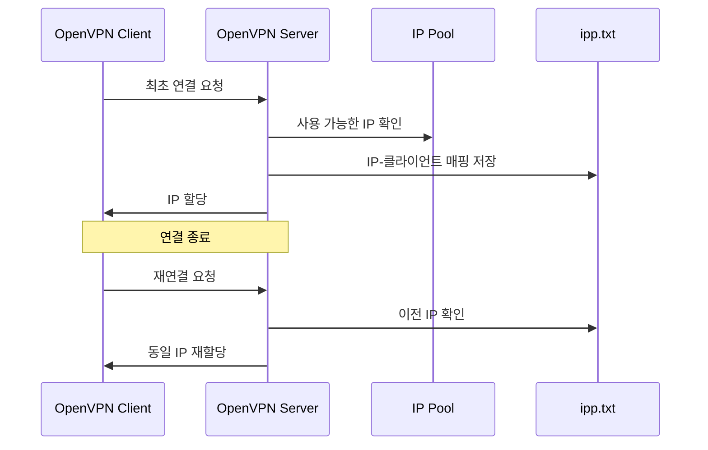

# ifconfig-pool-persist 설정의 이해

## 개념 설명
ifconfig-pool-persist는 OpenVPN 클라이언트의 IP 주소를 영구적으로 관리하는 메커니즘이다. 실생활에 비유하자면 호텔에서 단골 고객에게 항상 같은 객실을 배정하는 것과 유사하다.

## 기본 동작 방식
1. OpenVPN 서버는 클라이언트 연결 시 가상 IP 주소를 할당한다
2. 할당된 IP 주소는 ipp.txt 파일에 기록된다
3. 클라이언트가 재연결할 때 이전에 사용했던 IP를 재할당한다

```plaintext
# ipp.txt 파일 예시
client1,10.8.0.2,1700000000
client2,10.8.0.3,1700000000
```

## 실제 사용 예시

### 기본 설정
```conf
# /etc/openvpn/server.conf
port 1194
proto udp
dev tun
server 10.8.0.0 255.255.255.0
ifconfig-pool-persist ipp.txt
```

### 고급 설정
```conf
# 30초마다 파일 갱신
ifconfig-pool-persist ipp.txt 30

# 특정 클라이언트에 고정 IP 할당
client-config-dir ccd
```

## 필요한 이유
1. IP 주소 일관성 유지
   - 방화벽 규칙 적용 용이
   - 로그 추적 및 모니터링 효율화
   - 클라이언트 식별 간소화

2. 네트워크 안정성 향상
   - IP 충돌 방지
   - DNS 캐싱 효율 증가
   - 애플리케이션 연속성 보장

## 시스템 아키텍처



## 주의사항
- ipp.txt 파일 백업 필요
- 파일 권한 설정 중요 (600 권장)
- 수동 편집 시 주의 필요
- 서버 재시작 시 파일 보존 확인

## 성능 고려사항
1. 파일 갱신 주기
   - 너무 짧으면 디스크 I/O 부하 증가
   - 너무 길면 IP 할당 정보 유실 위험

2. 파일 크기 관리
   - 정기적인 정리 필요
   - 오래된 항목 제거

## 결론
ifconfig-pool-persist 설정은 OpenVPN 환경에서 안정적인 IP 관리를 위한 필수적인 요소이다. 클라이언트 식별, 보안 정책 적용, 네트워크 안정성 측면에서 중요한 역할을 수행하므로 적절한 설정과 관리가 필요하다.