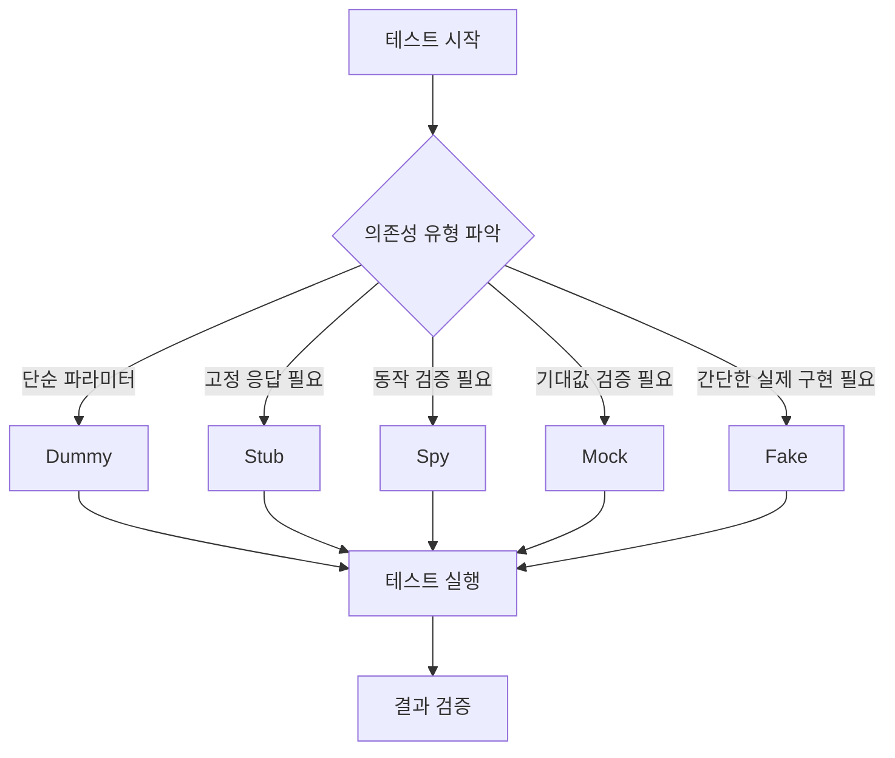

# Test Double 개념 이해하기

## 기본 개념
Test Double은 소프트웨어 테스트에서 실제 객체를 대체하는 가짜 객체를 의미한다. 영화 촬영에서 위험한 장면을 대신 연기하는 스턴트맨(Stunt Double)에서 유래한 용어이다.

## 사용 목적
- 테스트 실행 속도 향상
- 외부 의존성 제거
- 특정 시나리오 테스트 용이성 확보
- 예측 가능한 테스트 환경 구성

# Test Double의 종류

## 1. Dummy Objects
가장 단순한 형태의 Test Double로, 단순히 파라미터를 채우기 위해 사용된다.

```php
class DummyLogger implements LoggerInterface 
{
    public function log(string $message): void 
    {
        // 아무 동작도 하지 않음
    }
}

class UserService 
{
    private $logger;
    
    public function __construct(LoggerInterface $logger) 
    {
        $this->logger = $logger;
    }
    
    public function doSomething(): void 
    {
        // 로직 수행
        $this->logger->log("작업 완료");
    }
}

// 테스트 코드
$dummyLogger = new DummyLogger();
$service = new UserService($dummyLogger);
$service->doSomething(); // 로깅 없이 테스트 가능
```

## 2. Stub Objects
미리 준비된 답변을 제공하는 객체이다.

```php
class StubPaymentGateway implements PaymentGateway 
{
    public function processPayment(float $amount): bool 
    {
        return true; // 항상 결제 성공 반환
    }
    
    public function getBalance(): float 
    {
        return 1000.00; // 항상 동일한 잔액 반환
    }
}

// 테스트 코드
$stub = new StubPaymentGateway();
$orderService = new OrderService($stub);
$result = $orderService->purchase(500.00);
```

## 3. Spy Objects
메소드 호출을 기록하고 나중에 검증할 수 있는 객체이다.

```php
class SpyEmailSender implements EmailSender 
{
    private array $sentEmails = [];
    
    public function send(string $to, string $subject, string $body): void 
    {
        $this->sentEmails[] = [
            'to' => $to,
            'subject' => $subject,
            'body' => $body
        ];
    }
    
    public function getSentEmailsCount(): int 
    {
        return count($this->sentEmails);
    }
    
    public function getLastEmailSent(): ?array 
    {
        return empty($this->sentEmails) ? null : end($this->sentEmails);
    }
}

// 테스트 코드
$spy = new SpyEmailSender();
$notificationService = new NotificationService($spy);
$notificationService->notifyUser('test@example.com');

assertEquals(1, $spy->getSentEmailsCount());
assertEquals('test@example.com', $spy->getLastEmailSent()['to']);
```

## 4. Mock Objects
기대하는 동작을 미리 프로그래밍하고 검증하는 객체이다.

```php
// PHPUnit을 사용한 Mock 예시
public function testOrderProcessing(): void 
{
    // Mock 생성
    $mock = $this->createMock(PaymentGateway::class);
    
    // 기대 동작 설정
    $mock->expects($this->once())
         ->method('processPayment')
         ->with(100.00)
         ->willReturn(true);
    
    $orderService = new OrderService($mock);
    $result = $orderService->processOrder(100.00);
    
    $this->assertTrue($result);
}
```

## 5. Fake Objects
실제 구현을 단순화한 객체이다.

```php
class FakeDatabase implements Database 
{
    private array $data = [];
    
    public function save(string $key, mixed $value): void 
    {
        $this->data[$key] = $value;
    }
    
    public function get(string $key): mixed 
    {
        return $this->data[$key] ?? null;
    }
    
    public function delete(string $key): void 
    {
        unset($this->data[$key]);
    }
}

// 테스트 코드
$fake = new FakeDatabase();
$userRepository = new UserRepository($fake);
$userRepository->saveUser($user);
```

# 사용 시나리오와 Process Flow



# 구현 가이드라인

## 1. Test Double 선택 기준
- Dummy: 파라미터만 필요한 경우
- Stub: 단순한 반환값이 필요한 경우
- Spy: 호출 여부와 방법 검증이 필요한 경우
- Mock: 정확한 동작 방식 검증이 필요한 경우
- Fake: 실제와 유사한 동작이 필요한 경우

## 2. 효과적인 사용법
```php
// 잘못된 예시 - 과도한 Mock 사용
public function testUserRegistration(): void 
{
    $mockEmail = $this->createMock(EmailSender::class);
    $mockLogger = $this->createMock(Logger::class);
    $mockCache = $this->createMock(Cache::class);
    // 너무 많은 Mock은 테스트를 복잡하게 만든다
}

// 올바른 예시 - 필요한 부분만 Mock
public function testUserRegistration(): void 
{
    $mockEmail = $this->createMock(EmailSender::class);
    $logger = new SimpleLogger(); // 실제 구현체 사용
    $cache = new ArrayCache(); // 간단한 Fake 사용
}
```

# 주의사항

1. **과도한 Test Double 사용 피하기**
   - 핵심 비즈니스 로직은 실제 객체로 테스트한다
   - 외부 의존성이 있는 부분만 Test Double을 사용한다

2. **테스트 가독성 유지**
   - Test Double의 목적을 명확히 한다
   - 복잡한 설정은 헬퍼 메소드로 분리한다

3. **실제 동작과의 차이 인지**
   - Test Double은 실제 동작을 완벽히 모방할 수 없다
   - 중요한 시나리오는 통합 테스트로 보완한다

# Security 고려사항

```php
// 잘못된 예시 - 민감한 정보 노출
$stubAuth = new StubAuthenticator();
$stubAuth->setApiKey('actual-production-key'); // 실제 키 노출

// 올바른 예시 - 가짜 데이터 사용
$stubAuth = new StubAuthenticator();
$stubAuth->setApiKey('test-' . uniqid()); // 테스트용 가짜 키
```

# Performance 고려사항

1. **메모리 관리**
```php
public function tearDown(): void 
{
    // Test Double 정리
    Mockery::close();
    parent::tearDown();
}
```

2. **테스트 실행 속도**
- 무거운 의존성은 가벼운 Test Double로 대체
- 데이터베이스 대신 배열 기반 Fake 사용

# 결론

Test Double은 효과적인 단위 테스트를 위한 필수 도구이다. 다음 사항을 고려하여 사용한다:

1. 목적에 맞는 적절한 Test Double 선택
2. 실제 객체와 Test Double의 적절한 균형
3. 테스트 코드의 가독성과 유지보수성 고려
4. 보안과 성능 측면의 고려사항 준수

이러한 가이드라인을 따르면 더 효과적이고 안정적인 테스트 코드를 작성할 수 있다.